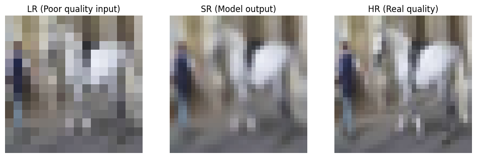
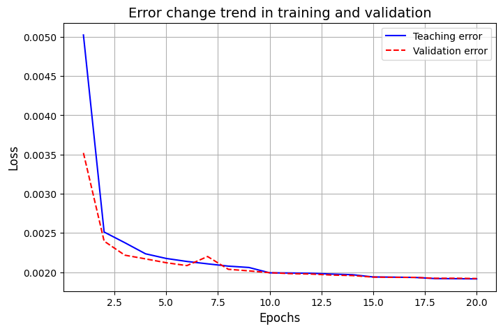
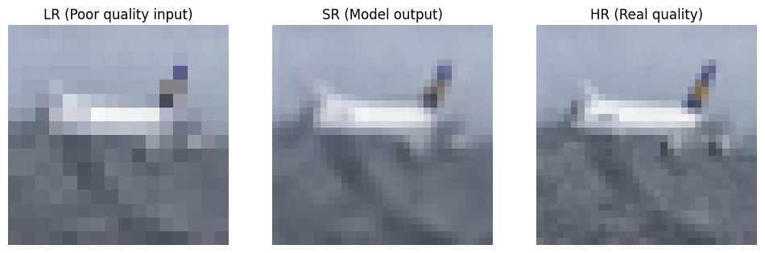
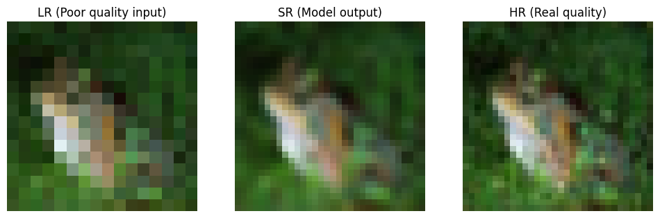
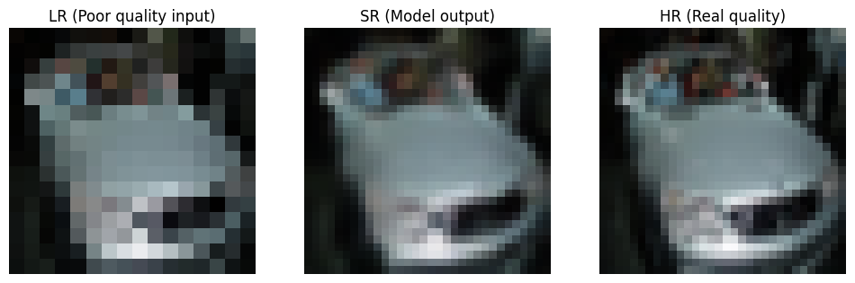

# Super-Resolution CNN Project on CIFAR-10 Dataset



## 📋 Project Overview

This project implements a **Super-Resolution** model using Convolutional Neural Networks (CNN) to enhance image quality on the CIFAR-10 dataset. The trained model can convert low-quality images (16×16 pixels) to high-quality images (32×32 pixels).

### 🎯 Project Goals
- Convert Low-Resolution images to High-Resolution
- Improve visual quality of images
- Preserve structure and content of original images
- Evaluate model performance using PSNR and SSIM metrics

## 🗂 Project Structure

```
Super-Resolution-CNN-CIFAR10/
├── model/
│   └── best_sr_model.keras          # Final trained model
├── notebooks/
│   └── model_training.jpynb         # Model training notebook
├── plots/                           # Generated plots
│   ├── plot-loss-history-plots.png          # Loss history plot
│   ├── visualize-hr-lr-comparison.png       # HR vs LR comparison
│   ├── sample-predict-and-show-triplets1.png # Output samples
│   ├── sample-predict-and-show-triplets2.png
│   ├── sample-predict-and-show-triplets3.png
│   ├── sample-predict-and-show-triplets4.png
│   └── sample-predict-and-show-triplets5.png
├── .gitignore
├── LICENSE
├── README.md                        # This file
└── requirements.txt                 # Requirements
```

## 📊 Dataset

This project uses the **CIFAR-10** dataset which contains 60,000 32×32 color images across 10 different classes.

- **High-Resolution Images (Target)**: 32×32 pixels
- **Low-Resolution Images (Input)**: 16×16 pixels

### Data Preprocessing
- Normalize pixel values to range [0, 1]
- Convert 32×32 images to 16×16 to create Low-Resolution input
- Split data into training, validation, and test sets

## 🏗 Model Architecture

The model uses a CNN architecture with the following components:

### Main Blocks:
1. **Input**: Low-Resolution images (16×16×3)
2. **Feature Extraction**: Two convolutional layers with 64 filters
3. **Upsampling**: Conv2DTranspose layer for dimension increase
4. **Quality Refinement**: Two additional convolutional layers
5. **Output**: Super-Resolution image (32×32×3)

### Key Parameters:
- Activation function: ReLU (except output using sigmoid)
- Loss function: MSE (Mean Squared Error)
- Optimizer: Adam
- Evaluation metrics: MAE, SSIM, PSNR

## 🚀 Model Training

### Training Configuration:
- **Batch size**: 64
- **Epochs**: 20
- **Callbacks**:
  - Early Stopping to prevent overfitting
  - ReduceLROnPlateau for learning rate adjustment
  - ModelCheckpoint to save best model

### Training Progress:


The chart above shows the reduction of training and validation loss across different epochs.

## 📈 Results and Evaluation

### Evaluation Metrics:
- **PSNR (Peak Signal-to-Noise Ratio)**: Image quality metric
- **SSIM (Structural Similarity Index)**: Structural similarity metric
- **MAE (Mean Absolute Error)**: Mean absolute error

### Model Performance:
The trained model has achieved satisfactory results in enhancing image quality, with generated images being visually similar to the original High-Resolution images.

## 🖼 Output Samples

Below are samples of the model's output:






Each sample includes three images:
- **Left**: Low-Resolution image (model input)
- **Middle**: Super-Resolution image (model output)
- **Right**: High-Resolution image (ground truth)

## 🛠 Setup and Usage

### Requirements:
```bash
pip install -r requirements.txt
```

### Running the Project:
1. Clone the repository
2. Install requirements
3. Run the `model_training.jpynb` notebook to train the model
4. Use the trained model for inference

### Using the Trained Model:
```python
from tensorflow.keras.models import load_model

# Load the model
model = load_model('model/best_sr_model.keras')

# Predict on new images
sr_images = model.predict(lr_images)
```

**⚠️ Note: If you are not using Google Colab, GPU processing settings may differ:**

- **In Google Colab**: Uses Tesla T4 or similar GPU by default
- **In local environment**: Requires manual installation of CUDA and cuDNN drivers
- **Memory settings**: You may need to reduce batch size on systems with less GPU memory

## 💡 Key Features

- **High Performance**: Model capable of producing quality images in reasonable time
- **Simple Implementation**: Straightforward and understandable architecture
- **Comprehensive Evaluation**: Multiple metrics for quality assessment
- **Complete Documentation**: Visual samples and analytical charts provided


## 👨‍💻 Author
**Masoud Ghasemi**

- **GitHub**: [sorna-fast](https://github.com/sorna-fast)
- **Email**: [masudpythongit@gmail.com](mailto:masudpythongit@gmail.com)
- **linkedin**: [masoud-ghasemi](https://www.linkedin.com/in/masoud-ghasemi-748412381)
- **Telegram**: [@Masoud_Ghasemi_sorna_fast](https://t.me/Masoud_Ghasemi_sorna_fast)


## 📄 License

This project is released under the [MIT License](LICENSE).

