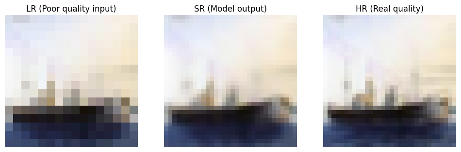

# Super-Resolution CNN Project on CIFAR-10 Dataset


## 📋 Project Overview

This project implements a **Super-Resolution** model using Convolutional Neural Networks (CNN) to enhance image quality on the CIFAR-10 dataset. The trained model can convert low-quality images (16×16 pixels) to high-quality images (32×32 pixels) with impressive performance metrics.

### 🎯 Project Goals
- Convert Low-Resolution images to High-Resolution
- Improve visual quality of images
- Preserve structure and content of original images
- Achieve high PSNR and SSIM scores for quality assessment

## 🗂 Project Structure

```
Super-Resolution-CNN-CIFAR10/
├── model/
│   └── best_sr_model.keras          # Final trained model (225,027 parameters)
├── notebooks/
│   └── model_training.jpynb         # Model training notebook
├── plots/                           # Generated plots
│   ├── plot-loss-history-plots.png          # Loss history plot
│   ├── visualize-hr-lr-comparison.png       # HR vs LR comparison
│   ├── sample-predict-and-show-triplets1.png # Output samples
│   ├── sample-predict-and-show-triplets2.png
│   ├── sample-predict-and-show-triplets3.png
│   ├── sample-predict-and-show-triplets4.png
│   └── sample-predict-and-show-triplets5.png
├── .gitignore
├── LICENSE
├── README.md                        # This file
└── requirements.txt                 # Requirements
```

## 📊 Dataset

This project uses the **CIFAR-10** dataset which contains 60,000 32×32 color images across 10 different classes.

- **High-Resolution Images (Target)**: 32×32 pixels
- **Low-Resolution Images (Input)**: 16×16 pixels

### Data Preprocessing
- Normalize pixel values to range [0, 1]
- Convert 32×32 images to 16×16 using bicubic interpolation
- Split data into training, validation, and test sets

## 🏗 Model Architecture

The model uses an efficient CNN architecture with the following components:

### Model Summary:
```
Model: "functional"
┏━━━━━━━━━━━━━━━━━━━━━━━━━━━━━━━━━┳━━━━━━━━━━━━━━━━━━━━━━━━┳━━━━━━━━━━━━━━━┓
┃ Layer (type)                    ┃ Output Shape           ┃       Param # ┃
┡━━━━━━━━━━━━━━━━━━━━━━━━━━━━━━━━━╇━━━━━━━━━━━━━━━━━━━━━━━━╇━━━━━━━━━━━━━━━┩
│ input_layer (InputLayer)        │ (None, 16, 16, 3)      │             0 │
├─────────────────────────────────┼────────────────────────┼───────────────┤
│ conv2d (Conv2D)                 │ (None, 16, 16, 64)     │         1,792 │
├─────────────────────────────────┼────────────────────────┼───────────────┤
│ conv2d_1 (Conv2D)               │ (None, 16, 16, 64)     │        36,928 │
├─────────────────────────────────┼────────────────────────┼───────────────┤
│ conv2d_transpose                │ (None, 32, 32, 128)    │        73,856 │
│ (Conv2DTranspose)               │                        │               │
├─────────────────────────────────┼────────────────────────┼───────────────┤
│ conv2d_2 (Conv2D)               │ (None, 32, 32, 64)     │        73,792 │
├─────────────────────────────────┼────────────────────────┼───────────────┤
│ conv2d_3 (Conv2D)               │ (None, 32, 32, 64)     │        36,928 │
├─────────────────────────────────┼────────────────────────┼───────────────┤
│ conv2d_4 (Conv2D)               │ (None, 32, 32, 3)      │         1,731 │
└─────────────────────────────────┴────────────────────────┴───────────────┘
 Total params: 225,027 (879.01 KB)
 Trainable params: 225,027 (879.01 KB)
 Non-trainable params: 0 (0.00 B)
```

### Architecture Details:
- **Feature Extraction**: Two convolutional layers (64 filters each)
- **Upsampling**: Conv2DTranspose layer with stride 2 for 2× upscaling
- **Refinement**: Two additional convolutional layers for quality enhancement
- **Output**: Final convolution to produce RGB image with sigmoid activation

### Key Parameters:
- **Activation function**: ReLU (except output using sigmoid)
- **Loss function**: MSE (Mean Squared Error)
- **Optimizer**: Adam
- **Evaluation metrics**: MAE, SSIM, PSNR

## 🚀 Model Training

### Training Configuration:
- **Batch size**: 64
- **Epochs**: 20
- **Initial Learning Rate**: Adaptive (reduced during training)
- **Training Time**: ~15 seconds per epoch

### Advanced Callbacks:
- **Early Stopping**: Patience of 3 epochs, restores best weights
- **ReduceLROnPlateau**: Reduces learning rate by factor of 0.5 when validation loss plateaus
- **ModelCheckpoint**: Saves best model based on validation loss

### Training Progress:


The training showed consistent improvement with final metrics:
- **Training Loss**: 0.0019
- **Validation Loss**: 0.00192
- **PSNR**: ~28.0 dB
- **SSIM**: ~0.907

## 📈 Performance Results

### Final Evaluation Metrics:

| Metric         | Training | Validation | Test Set |
| -------------- | -------- | ---------- | -------- |
| **PSNR**       | 27.99 dB | 27.99 dB   | 28.13 dB |
| **SSIM**       | 0.9074   | 0.9075     | 0.9077   |
| **MAE**        | 0.0284   | 0.0285     | 0.0280   |
| **Loss (MSE)** | 0.0019   | 0.00192    | 0.0019   |

### Detailed Test Set Performance:
- **PSNR**: 28.13 dB ± 2.83 (higher is better)
- **SSIM**: 0.9077 ± 0.0395 (closer to 1.0 is better)

These results demonstrate excellent performance in super-resolution tasks, with the model successfully reconstructing high-quality images from low-resolution inputs.

## 🖼 Visual Results

Below are samples of the model's output showing the transformation pipeline:





Each sample demonstrates:
- **Left**: Low-Resolution input (16×16) - Model input
- **Middle**: Super-Resolution output (32×32) - Model prediction
- **Right**: High-Resolution target (32×32) - Ground truth

## 🛠 Technical Implementation

### Requirements:
```bash
pip install -r requirements.txt
```

### Key Dependencies:
- TensorFlow 2.x
- NumPy
- Matplotlib
- scikit-learn

### Training Process:
```python
history = model.fit(
    train_ds,
    epochs=20,
    validation_data=val_ds,
    callbacks=[early_stopping, reduce_lr, model_checkpoint],
    verbose=1
)
```

### Model Usage:
```python
from tensorflow.keras.models import load_model

# Load the trained model
model = load_model('model/best_sr_model.keras',
                  custom_objects={"psnr_metric": psnr_metric, "ssim_metric": ssim_metric})

# Generate super-resolution images
sr_images = model.predict(lr_images)
```
**⚠️ Note: If you are not using Google Colab, GPU processing settings may differ:**

- **In Google Colab**: Uses Tesla T4 or similar GPU by default
- **In local environment**: Requires manual installation of CUDA and cuDNN drivers
- **Memory settings**: You may need to reduce batch size on systems with less GPU memory

## 💡 Key Features & Innovations

### 🎯 Efficient Architecture
- **Compact Design**: Only 225K parameters making it lightweight
- **Progressive Upscaling**: Uses transposed convolution for 2× upsampling
- **Feature Preservation**: Multiple convolutional layers maintain image details

### 📊 Advanced Evaluation
- **Multiple Metrics**: Comprehensive assessment using PSNR, SSIM, and MAE
- **Visual Validation**: Side-by-side comparison of LR, SR, and HR images
- **Statistical Analysis**: Mean and standard deviation reporting

### ⚡ Optimization Techniques
- **Adaptive Learning**: Dynamic learning rate adjustment
- **Early Stopping**: Prevents overfitting while maintaining performance
- **Best Model Saving**: Automatic preservation of optimal weights

## 🎉 Achievements

- **Successfully implemented** a CNN-based super-resolution model
- **Achieved high-quality results** with PSNR > 28 dB and SSIM > 0.90
- **Efficient training** with fast convergence (20 epochs)
- **Comprehensive evaluation** with both quantitative and qualitative analysis


## 👨‍💻 Author
**Masoud Ghasemi**

- **GitHub**: [sorna-fast](https://github.com/sorna-fast)
- **Email**: [masudpythongit@gmail.com](mailto:masudpythongit@gmail.com)
- **linkedin**: [masoud-ghasemi](https://www.linkedin.com/in/masoud-ghasemi-748412381)
- **Telegram**: [@Masoud_Ghasemi_sorna_fast](https://t.me/Masoud_Ghasemi_sorna_fast)

## 📄 License

This project is released under the [MIT License](LICENSE).
